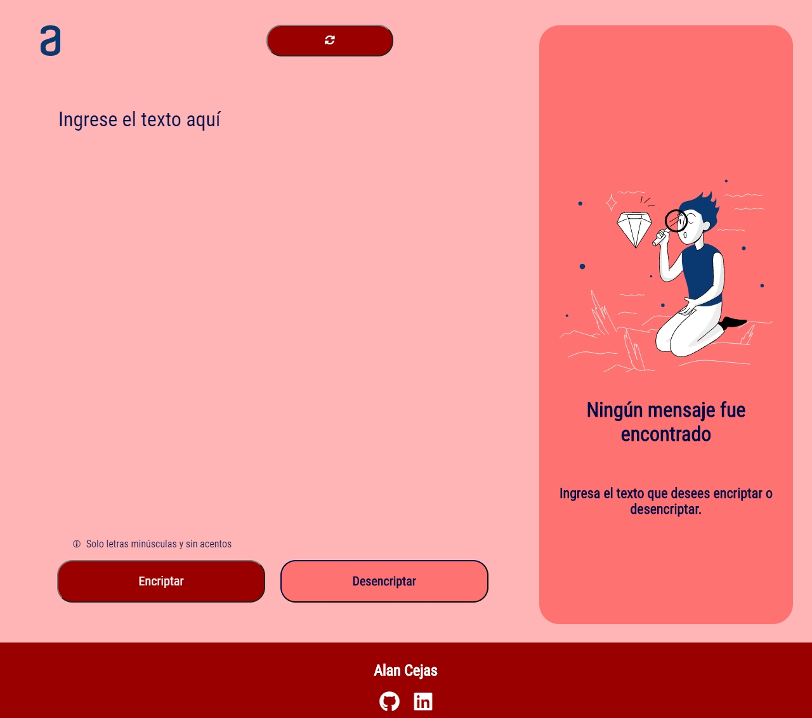

# Codificador de texto | Challenge #1 ONE
Construcción de un Codificador/Decodificador de Texto.
En este desafío realizamos una aplicación que encripta textos, así se podrá intercambiar mensajes secretos con otras personas que sepan el secreto de la codificación utilizada.

## Llaves de codificación
Las "llaves" de codificación que utilizaremos son las siguientes:

**La letra "e"** es convertida para "enter"

**La letra "i"** es convertida para "imes"

**La letra "a"** es convertida para "ai"

**La letra "o"** es convertida para "ober"

**La letra "u"** es convertida para "ufat"

## Requisitos del challenge:
- Debe funcionar solo con letras minúsculas
- No deben ser utilizados letras con acentos ni caracteres especiales
- Debe ser posible convertir una palabra para la versión encriptada también devolver una palabra encriptada para su versión original.

Por ejemplo:
"gato" => "gaitober"
gaitober" => "gato"

La página debe tener campos para
inserción del texto que será encriptado o desencriptado, y el usuario debe poder escoger entre as dos opciones.
El resultado debe ser mostrado en la pantalla.
Extras:
- Un botón que copie el texto encriptado/desencriptado para la sección de transferencia, o sea que tenga la misma funcionalidad del ctrl+C o de la opción "copiar" del menú de las aplicaciones.

## Tecnologias utilizadas

  

## Funcionamiento

  

- Posee un botón toggle para cambiar entre modo oscuro y normal

- Al escribir un texto en el textarea tendremos el botón encriptar para codificar el texto y su resultado saldra en la salida de la sección derecha.

- Al ingresar un texto codificado en el textarea podemos decodificarlo con el boton desencriptar.

- Tiene un botón para copiar el texto de salida.

- Al ingresar mayusculas, numeros o caracteres especiales no validos accionara un alert de error.

### **Puedes ver la Live Demo [Aqui](https://alandcejas01.github.io/challenge1-ONE-Codificador/).**
